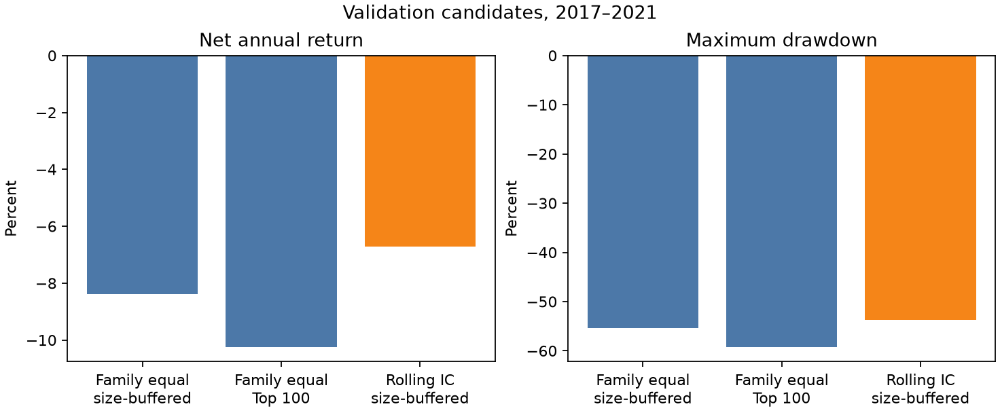

# A股横截面多因子研究与验证版 v1.0

本仓库实现一套可复现、可审计的 A 股横截面多因子研究流程：从只读原始日线数据出发，完成动态股票池、单因子检验、因子合成、含交易成本的正式执行回测、独立验证期评价和稳健性分析。

> **版本边界：** v1.0 已完成研究期与验证期工作；2022–2025 最终样本外测试继续封存，Stage 9–10 延期为可选 v2.0。因此本版本不提供最终样本外有效性结论，也不构成投资建议。

## 主要结论

| 环节 | 冻结结果 | 应如何解释 |
|---|---|---|
| 单因子研究（2005–2016） | 14 个预注册因子中 6 个 candidate、5 个 watch、3 个 reject | candidate 只表示通过研究期门槛；价值因子因 point-in-time 口径未核验最多为 watch |
| 因子合成（2005–2016） | `family_equal` 的 20 日平均 Rank IC 为 0.102201，ICIR 为 2.735685 | 简单等权未被表现相近的滚动 IC 方法替换 |
| 正式执行回测（2005–2016） | 完整成本年化收益 17.6031%，最大回撤 -66.9638%，实现短缺率 0.3805% | 这是研究期、日线级保守执行模拟，不是样本外收益保证 |
| 独立验证（2017–2021） | 冻结规则选择 `rolling_ic_family_size_stratified_buffered`；Rank IC 0.0889，但净年化收益 -6.71%、最大回撤 -53.78% | 截面排序信号仍存在，但没有转化为正的净组合收益；该不利结果被完整保留 |
| 稳健性（2005–2021） | 25 个稳定实验、9 个敏感实验、2 个失败或未运行实验 | 成本和冲击假设对收益有实质影响，稳健性结果不用于重新挑选主方案 |



验证期三个候选方案的净年化收益均为负。选择结果来自预先冻结的相对比较规则，不等于“策略已验证盈利”。

## 研究设计

- **研究期：** 2005-01-01 至 2016-12-31。
- **验证期：** 2017-01-01 至 2021-12-31。
- **最终测试期：** 2022-01-01 至 2025-12-31，v1.0 中封存。
- **因子族：** 价值、动量、短期反转、流动性、低波动和规模，共 14 个预注册因子。
- **信号与成交：** 信号在月末收盘后形成，最早在下一真实交易日开盘执行。
- **执行约束：** T+1、整手、停牌、涨跌停、容量、佣金、最低佣金、印花税、滑点、冲击成本、未成交订单、公司行动和三套独立账本。
- **防泄漏：** 动态历史股票池；未来收益只作标签；滚动权重严格滞后；最终测试期不进入 v1.0 报告、图表或选择规则。

数据流保持单向：

```text
原始 CSV（只读）
  → 规范日面板与数据清单
  → 动态股票池、标签与因子面板
  → 单因子评价与因子卡片
  → 复合分数与目标权重
  → 订单、成交、持仓、现金与 NAV
  → 验证期评价与稳健性 release
  → v1.0 文档交付
```

## 快速验证

当前验证环境为 **CPython 3.14.7 / polars 1.43.2**：全部依赖（含传递依赖）锁定在 `requirements-reproducible.txt`，直接依赖版本另见 `requirements-verified.txt`，兼容范围由 `pyproject.toml` 声明（`requires-python = ">=3.12"`）。复用现有 `.venv`，新建环境时按锁定文件安装：

```bash
/opt/homebrew/bin/python3.14 --version   # 应为 Python 3.14.7
/opt/homebrew/bin/python3.14 -m venv .venv
.venv/bin/python -m pip install -r requirements-reproducible.txt
.venv/bin/python -m pip install --no-deps -e ".[dev]"
.venv/bin/python -m pytest -q
.venv/bin/python -m ruff check src tests
.venv/bin/python -m ashare_multifactor.cli.delivery check
```

锁定文件固定版本但不含下载哈希，并且只在 macOS arm64 上验证过；同一份文件在声明的 Python 最低版本 3.12 上也通过安装与测试。历史证书保留 CPython 3.14.6 / polars 1.42.1 身份；新环境的新运行必须生成自己的代码身份与证书，不能覆盖历史记录，也不能用当前锁定文件冒充历史环境。

以上命令只运行人工合成测试、静态检查和交付一致性检查，不需要本地 28GB 原始数据，也不需要 `processed/`。交付检查核对仓库内 Markdown 链接、报告中关键数字与 `docs/results/v1.0-key-results.json` 记录的机器结果、以及 v1.0 manifest 的发布提交哈希；加 `--verify-sources` 可在保留 `processed/` 的机器上把数值重新读回权威 release。自动检查配置见 `.github/workflows/ci.yml`，完整重建与 release 回读见[复现说明](docs/reproduction.md)。

## 数据边界

本仓库不分发原始行情、`processed/`、`artifacts/` 或官方公告缓存。完整运行需在仓库根目录准备：

```text
Data/每天一个文件/不复权/
Data/每天一个文件/后复权/
```

不复权数据用于研究和成交状态，后复权数据用于跨期收益与影子核验；二者按 `(date, symbol)` 严格一对一连接。原始数据来源、授权、历史行业、ST 口径和估值 point-in-time 证据仍有未解决限制，详见[数据说明](docs/data/README.md)与[已知限制](docs/limitations.md)。

## 交付索引

- [最终研究报告](reports/research_report.md)
- [复现说明](docs/reproduction.md)
- [结果字典](docs/result_dictionary.md)
- [关键图表与机器结果索引](docs/results/index.md)
- [关键结果机器记录](docs/results/v1.0-key-results.json)
- [已知限制](docs/limitations.md)
- [Stage 9–10 延期归档](docs/stage9-10-archive.md)
- [v1.0 机器可读 manifest](releases/v1.0.0-research-validation.json)
- [研究协议](docs/research_protocol.md)
- [字段与原始数据说明](docs/data/README.md)

## 版本声明

`v1.0.0-research-validation` 表示“A股多因子研究与验证版 v1.0 已完成”。它不表示原总项目中最终样本外测试、检查点 C 或全范围 Stage 10 已完成。

## 许可证

本仓库中由 `Ryuke486` 原创的源代码和原创文档采用 [MIT License](LICENSE)。`Data/`、`processed/`、`artifacts/`、官方公告、原始市场数据及其他第三方材料不属于该 MIT 授权范围；其权利仍归各自权利人所有，使用时须遵守相应来源的条款。
