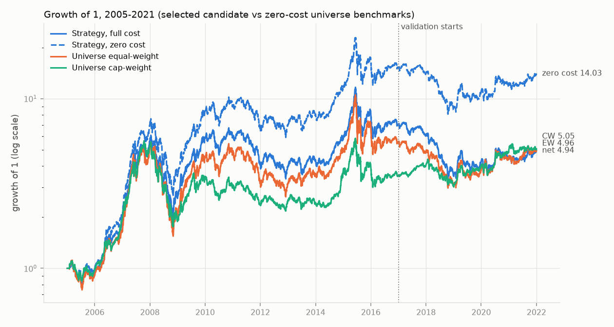
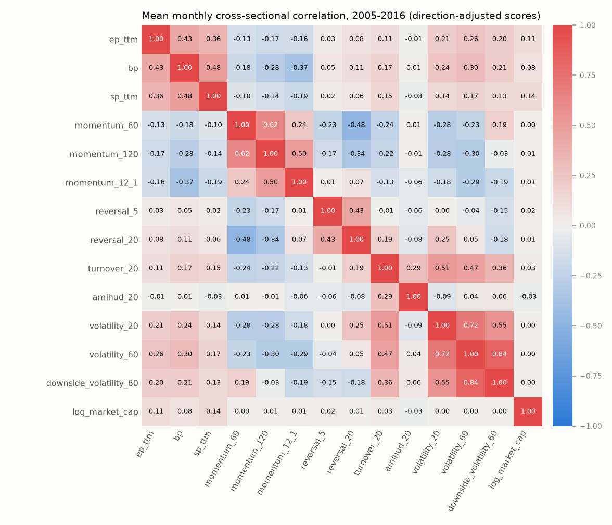
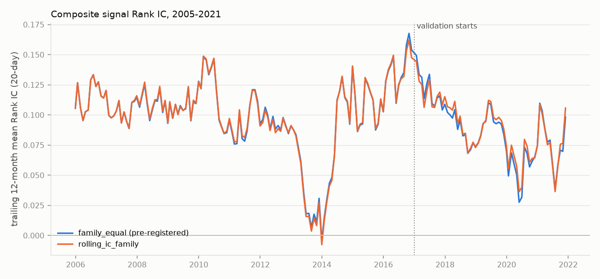
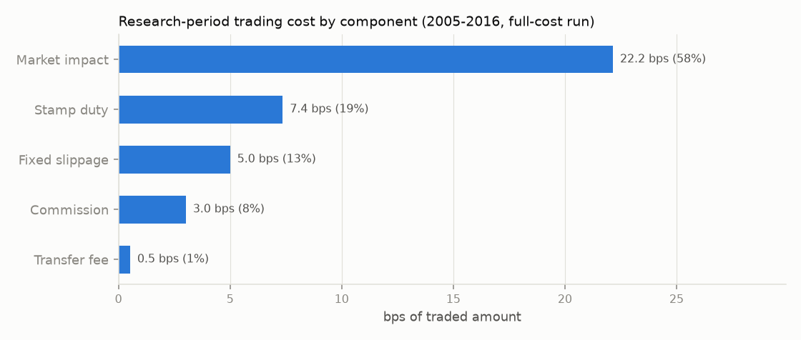
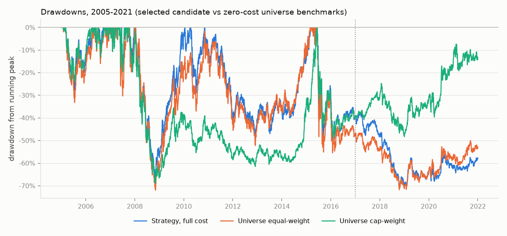
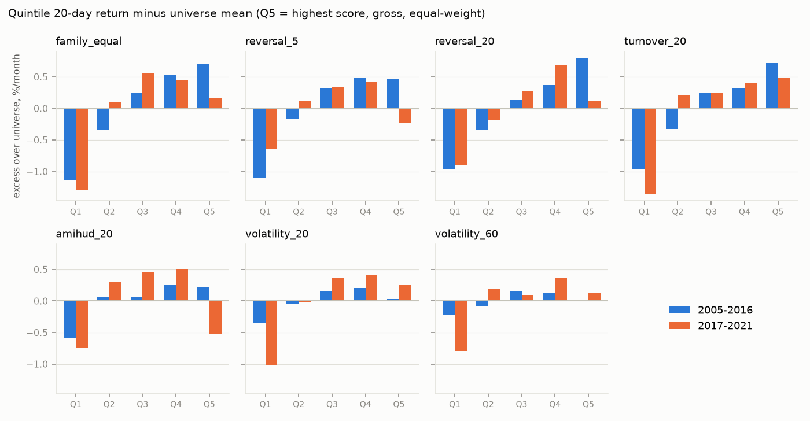

# v1.0 关键图表与机器结果索引

## 已提交图表

### 研究期复合因子 Rank IC

- 图表：`docs/assets/v1/research_composite_ic.png`
- 来源：Stage 5 release `667e0ee00d8941e9a1f5db9a963ae9c3`
- 原文件：`processed/factor_combination/releases/667e0ee00d8941e9a1f5db9a963ae9c3/artifacts/figures/composite_ic.png`
- 图表 SHA-256：`3f03a1393cb9f7b1c42f44fbb4dc2517dff24be24c6959da2a4e9b55a3fb2690`

### 验证期候选方案

- 图表：`docs/assets/v1/validation_candidate_comparison.png`
- 来源：Stage 7 release `65b19e1_stage7_validation_controlled_collector_successor`
- 数据集：`artifacts/research/validation_metrics.parquet`
- 展示字段：`net_annual_return`、`maximum_drawdown`
- 图表 SHA-256：`ae571a4616c12333f5d9ab488bf395e697068d5471cb41e8692870a545b8f02e`

### 执行成本敏感性

- 图表：`docs/assets/v1/execution_cost_sensitivity.png`
- 来源：Stage 8 release `a1076c2_stage8_robustness_szse_statistics_successor`
- 数据集：`datasets/robustness_results.parquet`
- 展示字段：四个执行成本实验的 `annual_return`
- 图表 SHA-256：`2583e1d1d85a4f13a778e479c58cf9e8dd0d9aa9cdfecb5f38c18f9efd7ff92d`

### 策略与股票池基准增长对比

- 图表：`docs/assets/v1/benchmark_comparison.png`
- 来源：描述性补充 `artifacts/v1_supplements/`（`ashare_multifactor.cli.supplements`，代码提交 `6b2c82b`）
- 原文件：`artifacts/v1_supplements/figures/benchmark_comparison.png`
- 补充 manifest SHA-256：`5d60984e10f3823dc058a8c259aab5983b233ae89c4ff2b102fe57d5f046005b`
- 图表 SHA-256：`5b323213350a1a2ffe1749eb81e5af66b9814c18060dcb73dc15cd8ec0cb63d7`

以下五张图与上图出自同一次补充运行（同一代码提交与补充 manifest）。

### 因子平均截面相关

- 图表：`docs/assets/v1/factor_correlation_heatmap.png`
- 原文件：`artifacts/v1_supplements/figures/factor_correlation_heatmap.png`
- 数据表：`artifacts/factor_research/factor_correlations.csv`（Stage 4）
- 图表 SHA-256：`b8e72f46e9f0aa41ca22cf43a9ea478b8331b120c262b9244d725bdd5b658dbd`

### 复合信号滚动 Rank IC

- 图表：`docs/assets/v1/composite_rolling_ic.png`
- 原文件：`artifacts/v1_supplements/figures/composite_rolling_ic.png`
- 数据表：`artifacts/v1_supplements/rolling_ic.csv`（来自 Stage 5/7 已发布 IC 序列）
- 图表 SHA-256：`71864dfe5faa3212a2f769c465595a7d028294297c3b1ddd2c6151407462207c`

### 研究期交易成本构成

- 图表：`docs/assets/v1/research_cost_components.png`
- 原文件：`artifacts/v1_supplements/figures/research_cost_components.png`
- 数据表：`artifacts/v1_supplements/cost_components.csv`（来自 Stage 6 `cost_breakdown.csv` 与成交额）
- 图表 SHA-256：`5d952c94029c913a2f03cd8e1558394fa153c5a09a10559f158decb8af6049b6`

### 策略与股票池基准回撤

- 图表：`docs/assets/v1/drawdowns.png`
- 原文件：`artifacts/v1_supplements/figures/drawdowns.png`
- 数据表：`artifacts/v1_supplements/drawdowns.parquet`
- 图表 SHA-256：`d6dac068990fd28d11a7cb5363b87fc4cb13edac7ad34d9fe52fff359fdfbac7`

### 五分组相对股票池的超额收益

- 图表：`docs/assets/v1/quintile_excess.png`
- 原文件：`artifacts/v1_supplements/figures/quintile_excess.png`
- 数据表：`artifacts/v1_supplements/quintile_excess.csv`（来自 Stage 4/5/7 分组收益）
- 图表 SHA-256：`92ead2e21f20325b6b8974f007f409c6c0ccfe5b538ac44c7e65a3f9a27afeb9`

## 本地 machine-readable release

下列路径默认被 Git 忽略，只在完整本地研究环境中存在：

| 阶段 | 权威入口 | 主要结果 |
|---|---|---|
| Stage 4 | `artifacts/factor_research/manifest.json` | 因子分类、Rank IC、分组、换手、因子卡片 |
| Stage 5 | `processed/factor_combination/CURRENT.json` | 复合分数、目标权重、组合诊断 |
| Stage 6 | `processed/formal_backtest/CURRENT.json` | 订单、成交、持仓、三账本、NAV、成本与对账 |
| Stage 7 | `processed/validation_evaluation/CURRENT.json` | 三个冻结候选的验证指标与选择决定 |
| Stage 8 | `processed/robustness/CURRENT.json` | 稳健性实验、协议门禁与证据工作流审计 |
| 描述性补充 | `artifacts/v1_supplements/manifest.json` | 股票池基准对比、自然年收益、多空两条腿分解 |
| Stage 9 | `processed/final_test/CURRENT.json` | v1.0 中必须不存在 |

报告数字的字段级映射见[结果字典](../result_dictionary.md)。各 release 的 run id、manifest 哈希和交付文件哈希见[v1.0 manifest](../../releases/v1.0.0-research-validation.json)。

## 机器可读关键结果记录

[v1.0-key-results.json](v1.0-key-results.json) 把交付文档中引用的 268 项关键数字绑定到权威 release、artifact 路径和 artifact 哈希：每一条记录数值、来源、被引用的文档以及引用字面量。它由 `ashare-delivery record-results` 从本地 release 生成，不手工填写。

- `ashare-delivery check` 验证文档中的数字仍是记录值的精确渲染，并且仍出现在要求的文档中；
- `ashare-delivery check --verify-sources` 在保留 `processed/` 的机器上把记录数值重新读回 release，并核对 artifact 字节未变；
- 研究结果变化时，先重新生成记录，再同步文档，最后重跑检查；不要手工编辑该 JSON。
