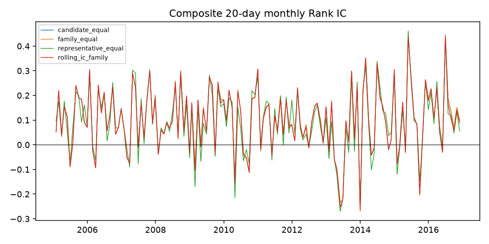
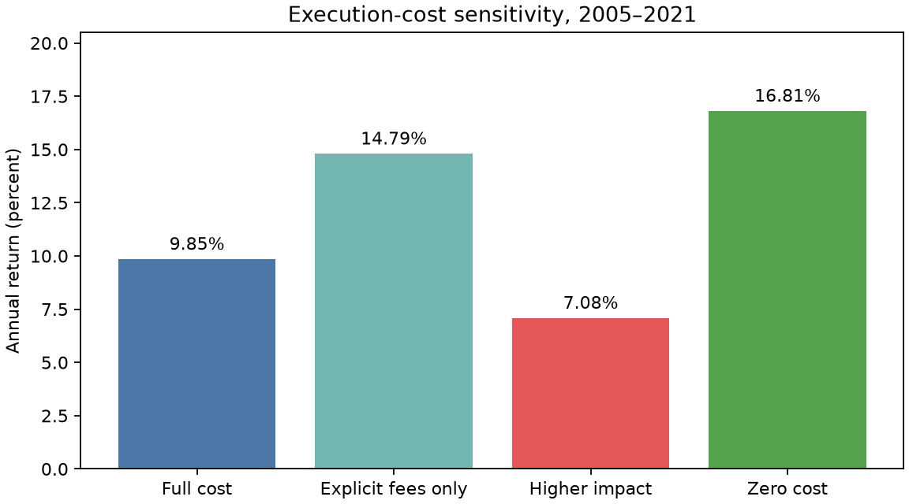

# v1.0 关键图表与机器结果索引

## 已提交图表

### 研究期复合因子 Rank IC

- 图表：`docs/assets/v1/research_composite_ic.png`
- 来源：Stage 5 release `667e0ee00d8941e9a1f5db9a963ae9c3`
- 原文件：`processed/factor_combination/releases/667e0ee00d8941e9a1f5db9a963ae9c3/artifacts/figures/composite_ic.png`
- 图表 SHA-256：`3f03a1393cb9f7b1c42f44fbb4dc2517dff24be24c6959da2a4e9b55a3fb2690`

### 验证期候选方案

- 图表：`docs/assets/v1/validation_candidate_comparison.png`
- 来源：Stage 7 release `65b19e1_stage7_validation_controlled_collector_successor`
- 数据集：`artifacts/research/validation_metrics.parquet`
- 展示字段：`net_annual_return`、`maximum_drawdown`
- 图表 SHA-256：`ae571a4616c12333f5d9ab488bf395e697068d5471cb41e8692870a545b8f02e`

### 执行成本敏感性

- 图表：`docs/assets/v1/execution_cost_sensitivity.png`
- 来源：Stage 8 release `a1076c2_stage8_robustness_szse_statistics_successor`
- 数据集：`datasets/robustness_results.parquet`
- 展示字段：四个执行成本实验的 `annual_return`
- 图表 SHA-256：`2583e1d1d85a4f13a778e479c58cf9e8dd0d9aa9cdfecb5f38c18f9efd7ff92d`

## 本地 machine-readable release

下列路径默认被 Git 忽略，只在完整本地研究环境中存在：

| 阶段 | 权威入口 | 主要结果 |
|---|---|---|
| Stage 4 | `artifacts/factor_research/manifest.json` | 因子分类、Rank IC、分组、换手、因子卡片 |
| Stage 5 | `processed/factor_combination/CURRENT.json` | 复合分数、目标权重、组合诊断 |
| Stage 6 | `processed/formal_backtest/CURRENT.json` | 订单、成交、持仓、三账本、NAV、成本与对账 |
| Stage 7 | `processed/validation_evaluation/CURRENT.json` | 三个冻结候选的验证指标与选择决定 |
| Stage 8 | `processed/robustness/CURRENT.json` | 稳健性实验、协议门禁与证据工作流审计 |
| Stage 9 | `processed/final_test/CURRENT.json` | v1.0 中必须不存在 |

报告数字的字段级映射见[结果字典](../result_dictionary.md)。各 release 的 run id、manifest 哈希和交付文件哈希见[v1.0 manifest](../../releases/v1.0.0-research-validation.json)。

## 机器可读关键结果记录

[v1.0-key-results.json](v1.0-key-results.json) 把交付文档中引用的 51 项关键数字绑定到权威 release、artifact 路径和 artifact 哈希：每一条记录数值、来源、被引用的文档以及引用字面量。它由 `ashare-delivery record-results` 从本地 release 生成，不手工填写。

- `ashare-delivery check` 验证文档中的数字仍是记录值的精确渲染，并且仍出现在要求的文档中；
- `ashare-delivery check --verify-sources` 在保留 `processed/` 的机器上把记录数值重新读回 release，并核对 artifact 字节未变；
- 研究结果变化时，先重新生成记录，再同步文档，最后重跑检查；不要手工编辑该 JSON。
